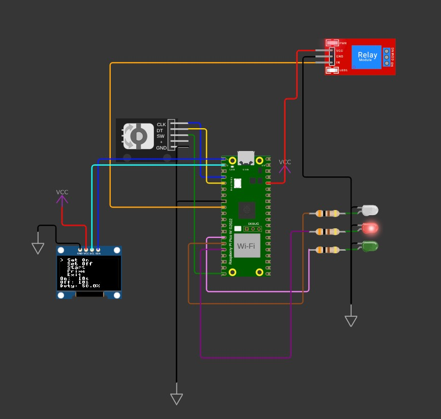
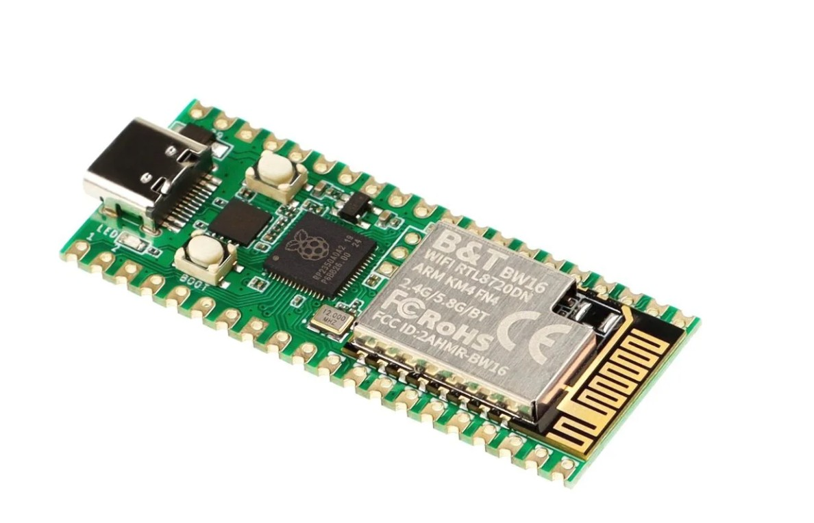

# Pico W5 Adjustable Duty Cycle Timer

A repeating on/off timer for 120V AC loads using the **Elecrow Pico W5** (RP2350) with MicroPython.

Control via single rotary encoder:
- Rotate → navigate menu / adjust values
- Short press (< 3s) → select / enter / save / start
- Long press (> 3s) → back / cancel / stop

Features:
- Adjustable on/off times (seconds)
- Duty cycle % display on OLED
- Repeating cycle mode
- "Prime" mode: one-shot ON for adjustable duration (15 s steps)
- 128×64 OLED display (SSD1306 I²C)
- LEDs:  
  - Green = breathes when cycle/prime active, solid when in menu  
  - Red = solid ON when relay is powered (during on_time or prime)

  

## Features in Detail
- Single rotary encoder with push button  
- Short press selects/enters/saves/starts  
- Long press (>3 s) backs out or stops cycle/prime  
- OLED shows current menu, times, duty cycle, status  
- Green LED breathes slowly during active timing (cycle or prime)  
- Green LED solid when idle in menu/settings  
- Red LED solid when relay is ON (load powered)

  

## Hardware Requirements

| Item                              | Notes / Example Model                              | Approx. Price |
|-----------------------------------|-----------------------------------------------------|---------------|
| Elecrow Pico W5                   | RP2350 microcontroller                              | $7–10        |
| SSD1306 OLED (128×64)             | I²C interface, 0.96" size                           | $3–6         |
| EC11 rotary encoder (bare, 5-pin) | 3 pins rotation + 2 pins push                       | $1–2         |
| Green LED + 220–330 Ω resistor    | PWM breathing (active cycle)                        | $0.10        |
| Red LED + 220–330 Ω resistor      | Solid when relay ON                                 | $0.10        |
| 5V single-channel relay module    | Opto-isolated, ≥10A @ 120VAC                        | $2–5         |
| Breadboard + jumper wires         | Prototyping                                         | $5–10        |
| USB-C cable                       | Programming & power                                 | —            |

## Software Requirements

- **MicroPython firmware** for RP2350  
  Download: https://micropython.org/download/ (choose RP2350 variant)

- **Thonny IDE**  
  Download: https://thonny.org

- **Libraries** (copy to Pico root – do not bundle in repo)

  | Library            | Purpose                        | Source Link                                                                 | Author              | License |
  |--------------------|--------------------------------|-----------------------------------------------------------------------------|---------------------|---------|
  | `ssd1306.py`       | OLED driver                    | https://github.com/stlehmann/micropython-ssd1306/blob/master/ssd1306.py     | Stefan Lehmann      | MIT     |
  | `rotary.py`        | Rotary encoder core            | https://github.com/miketeachman/micropython-rotary/blob/master/rotary.py    | Mike Teachman       | MIT     |
  | `rotary_irq_rp2.py`| Rotary interrupt driver        | https://github.com/miketeachman/micropython-rotary/blob/master/rotary_irq_rp2.py | Mike Teachman    | MIT     |

**Attribution**  
Thanks to Stefan Lehmann (ssd1306) and Mike Teachman (rotary / rotary_irq_rp2) for their excellent MIT-licensed libraries.

## Wiring Table

| Component                  | Pico GPIO | Physical Pin | Connection Notes                                      |
|----------------------------|-----------|--------------|-------------------------------------------------------|
| OLED SDA                   | GP0       | 1            | To OLED SDA                                           |
| OLED SCL                   | GP1       | 2            | To OLED SCL                                           |
| Encoder CLK (A)            | GP2       | 4            | Encoder 3-pin side (usually left)                     |
| Encoder DT (B)             | GP3       | 5            | Encoder 3-pin side (usually right)                    |
| Encoder Common (rotation)  | —         | —            | Middle pin → GND                                      |
| Encoder Push SW            | GP15      | 20           | One push pin → GP15, other → GND                      |
| Green LED                  | GP10      | 14           | Anode → GP10 via 220–330 Ω resistor → GND             |
| Red LED                    | GP12      | 16           | Anode → GP12 via 220–330 Ω resistor → GND             |
| Relay IN                   | GP6       | 9            | Relay signal (active low)                             |
| 3.3V                       | 3V3 OUT   | 36           | OLED VCC                                              |
| GND                        | GND       | 3,8,13,18,38 | All GND connections                                   |

**Encoder wiring** (bare EC11-style):
- 3-pin side: CLK → GP2, DT → GP3, middle → GND
- 2-pin side (push): one → GP15, other → GND

## Step-by-Step Setup Guide

### 1. Flash MicroPython
1. Download RP2350 .uf2 from https://micropython.org/download/
2. Hold BOOT button on Pico W5 while connecting USB-C → appears as drive
3. Drag .uf2 file onto drive → board reboots

### 2. Install Thonny & Connect
1. Download Thonny: https://thonny.org
2. Open Thonny → Interpreter → MicroPython (Raspberry Pi Pico)
3. Connect Pico → port appears

### 3. Upload Libraries
1. Download each file (Raw → Save As) from links above
2. In Thonny: File → Open → select file → Save as → MicroPython device → root

### 4. Upload Main Code
1. New file → paste code from below
2. Save as `main.py` on MicroPython device (auto-runs on boot)
3. Click Run

OLED shows "Starting..." → menu appears

## Usage Guide
- Rotate → move > cursor or change values
- Short press → select / save / start cycle or prime
- Long press (>3s) → back / stop

Menu: Set On → Set Off → Start → Prime → Exit

**LED Feedback**
- Green LED breathes when cycle or prime is active  
- Green LED solid when in menu/settings (program idle/active)  
- Red LED solid when relay is ON (load powered)

## Troubleshooting
- No display? → Check I²C (GP0/GP1), 3V3 power, address 0x3C  
- Encoder skips? → Turn slowly; add 10kΩ pull-ups GP2/GP3 → 3V3  
- Button not working? → Confirm GP15 + GND wiring  
- Relay not clicking? → Check active low (HIGH = off), 5V supply  
- Code errors? → View Thonny Shell (bottom pane)

## License
MIT License – see LICENSE file

**Thank you** to Stefan Lehmann (ssd1306) and Mike Teachman (rotary) for their MIT-licensed libraries!
